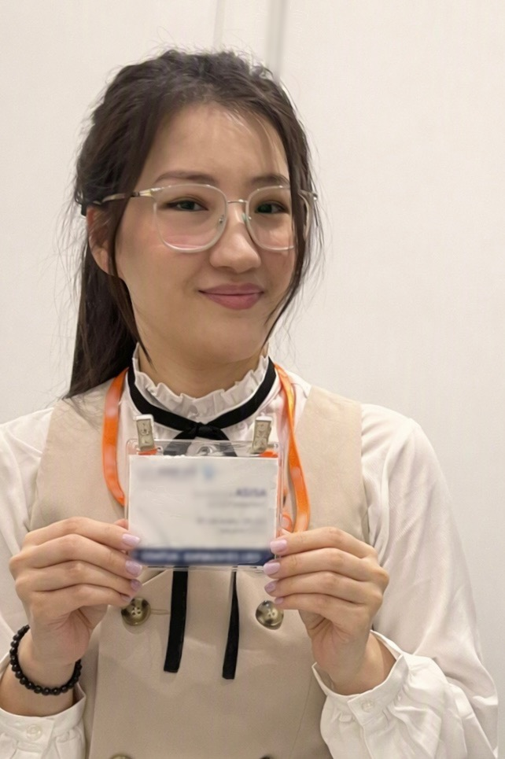

SLAM & Computer Vision Engineer  
3D Mapping • Visual Localization • Perception Systems

   

---

## About Me
I build perception and mapping systems for autonomous robots and AR/VR applications.
My work focuses on SLAM, 3D semantic mapping, change detection, and visual localization.

---

## Featured Projects
- **Visual Localization Prototype** — Relocalization under appearance change  
- **3D Semantic Mapping Demo** — SLAM + segmentation + change detection  
- **UAV Perception Modules** — Sensor fusion + autonomy stack  

---

## Publications
IEEE • ACM • ISPRS  
Full list on [Google Scholar](https://scholar.google.com/citations?view_op=list_works&hl=en&hl=en&user=2mTrGJMAAAAJ)

---

## Skills
Python • C++ • ROS2 • Docker  
SLAM • SfM • VIO • VPS

---

## Links
[CV](Aziza_CV_2026.pdf) • [GitHub](https://github.com/AzizaZhanabatyrova) • [LinkedIn](https://www.linkedin.com/in/azizazhanabatyrova?utm_source=share_via&utm_content=profile&utm_medium=member_ios) • [Google Scholar](https://scholar.google.com/citations?view_op=list_works&hl=en&hl=en&user=2mTrGJMAAAAJ)
